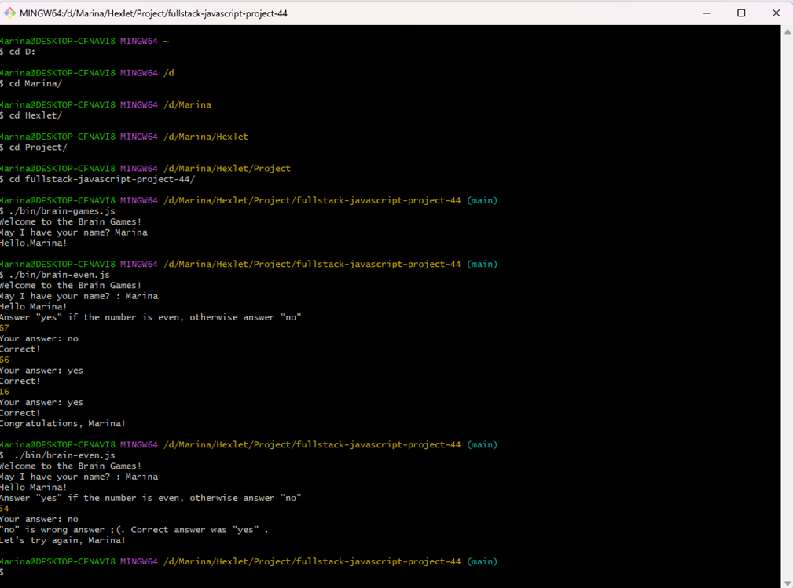
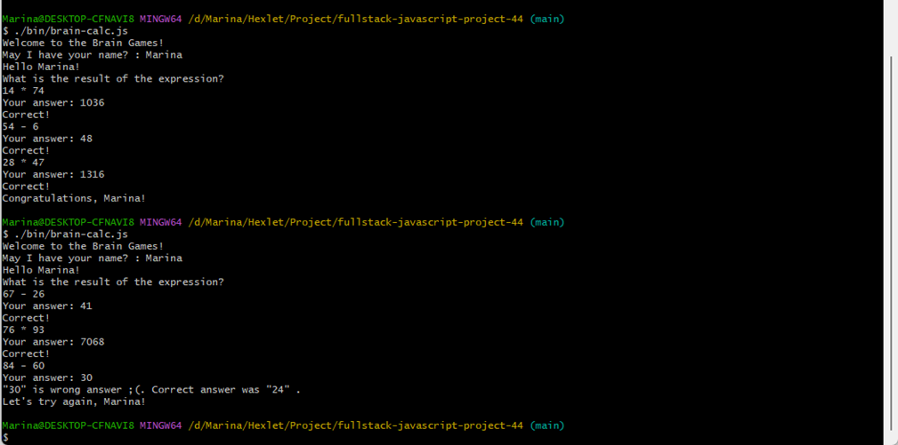
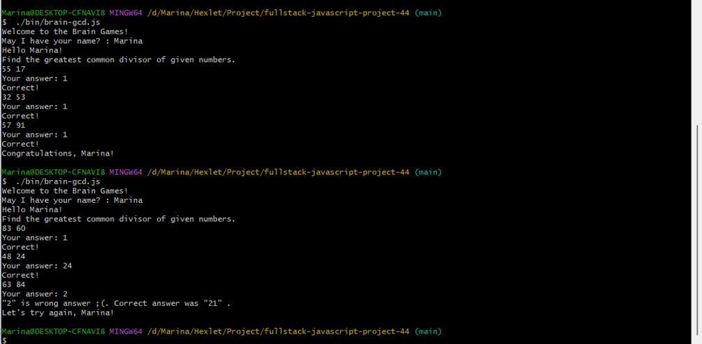
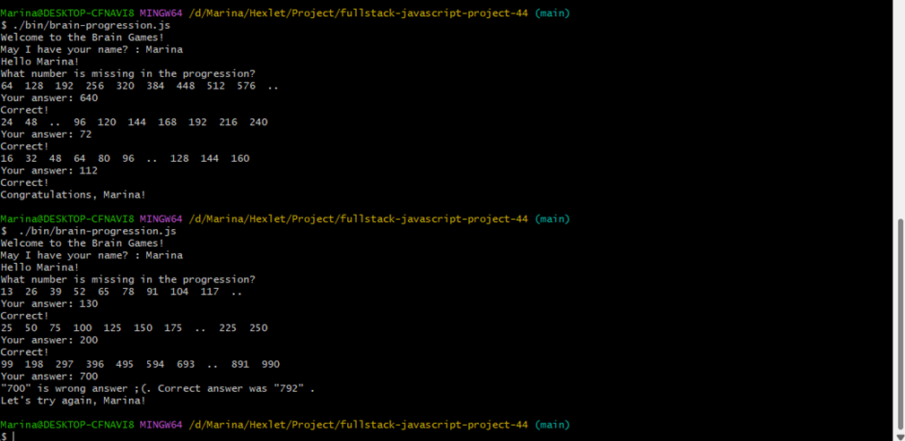
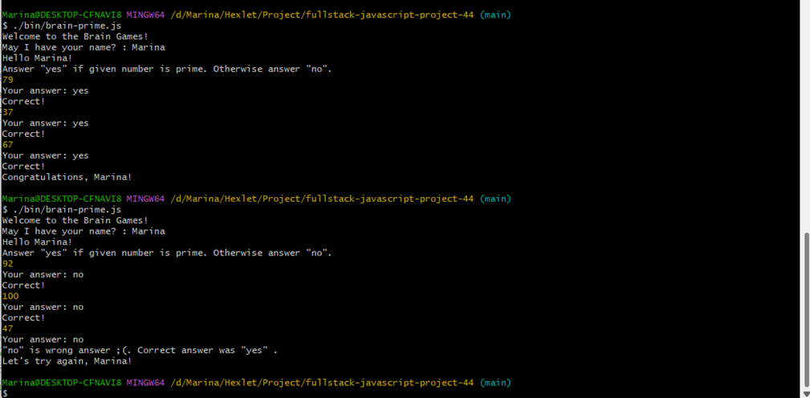

### Hexlet tests and linter status:

Проверяющий: Иван Гагаринов

Установка
$ git clone https://github.com/BudenchukM/fullstack-javascript-project-44.git

$ cd fullstack-javascript-project-44

$ npm install

$ npm link

Готово!

Проверка на четность
Запуск игры $ brain-even (если вы используете ОС Windows - ./bin/brain-even.js)
Правила игры: Пользователь видит рандомное число, он должен ответить yes, если число чётное, no — если нечётное.

 
Калькулятор
Правила игры: Пользователю показывается случайное математическое выражение, которое нужно вычислить и записать правильный ответ.
Запуск игры $ brain-calc (если вы используете ОС Windows - ./bin/brain-calc.js)

 

Наибольшой общий делитель (НОД)
Правила игры: Пользователю показывается два случайных числа. Пользователь должен вычислить и ввести наибольший общий делитель этих чисел.
Запуск игры $ brain-gcd (если вы используете ОС Windows - ./bin/brain-gcd.js)

 

Арифметическая прогрессия
Правила игры: Показываем игроку ряд чисел, образующий арифметическую прогрессию, заменив любое из чисел двумя точками. Игрок должен определить это число.
Запуск игры $ brain-progression (если вы используете ОС Windows - ./bin/brain- progression.js)

 

Простое ли число?
Правила игры: Показываем игроку случайное число. Игрок должен определить простое ли это число и ответить "yes", если оно простое или "no" - в ином случае.
Запуск игры $ brain-prime (если вы используете ОС Windows - ./bin/brain- prime.js)

 

